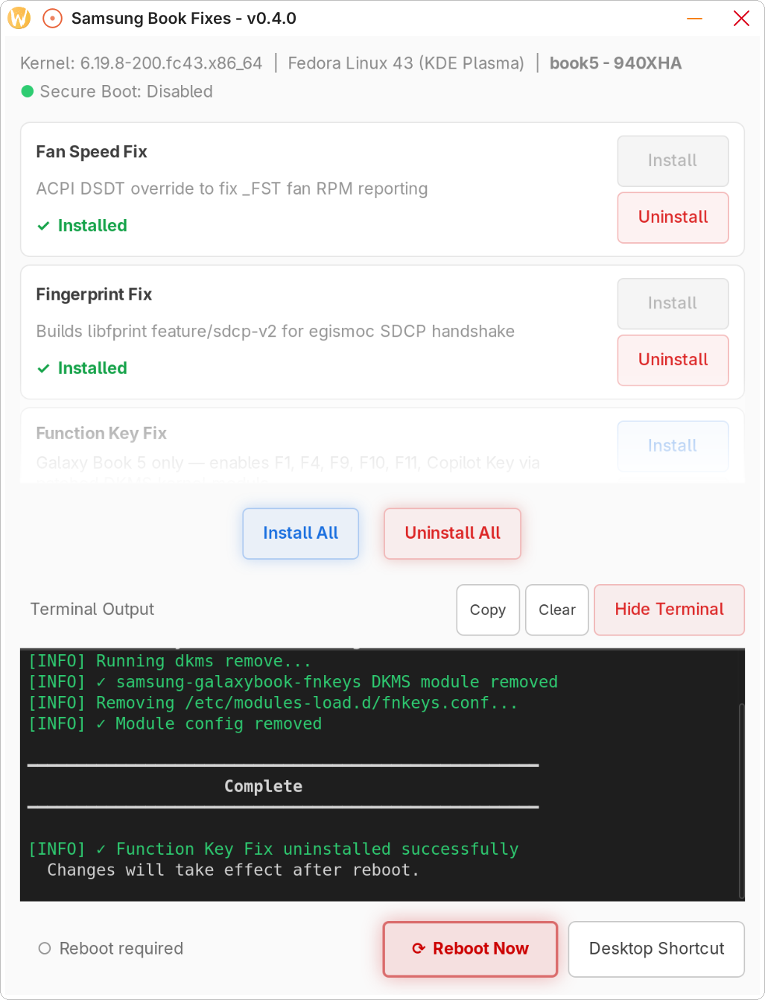

# Samsung Galaxy Book — Linux Fixes Summary

## Compatible Hardware

| Model | Status |
|-------|--------|
| Galaxy Book 5 Pro 940XHA (14") | ✅ Confirmed |
| Galaxy Book 5 Pro 960XHA (16") | ✅ Expected working - untested |
| Galaxy Book 5 Pro 360 960QHA | ✅ Expected working - untested |
| Galaxy Book 4 Pro 360 (960QGK) | ✅ Confirmed working — webcam fix and rotation fix confirmed (community, Ubuntu 24.04.2) |
| Galaxy Book 4 Pro / 360 / Edge (other) | ⚠️ Untested — may work |
| Galaxy Book 3 Pro / 360 / Ultra | ⚠️ Partial support — webcam fix and fingerprint fix work on confirmed models; speaker, fn-keys, and mic fix not yet supported |
| Galaxy Book 2 and older | ❌ Not supported |

> **Galaxy Book 3 notes:** The webcam fix (`webcam-fix-libcamera`) is confirmed working on 940XFG, 960XFG, 960QFG and 960XGL. The fingerprint fix works on all Book 3 models with the Egis sensor (`1c7a:05a1`). The fan speed fix, function key fix, speaker fix (requires MAX98390 — Book 3 uses ALC298), and mic fix are not yet confirmed for Book 3.

## Supported Linux Distributions

| Distro | Status |
|--------|--------|
| Fedora (kernel 6.13+) | ✅ Tested |
| Ubuntu / Debian-based (kernel 6.13+) | ⚠️ Untested — expected to work |
| Arch Linux (rolling) — includes EndeavourOS, Manjaro | ⚠️ Untested — code paths included |

> **PAM note (Ubuntu and Arch):** After the fingerprint fix is installed, PAM must be configured manually before fingerprint authentication will work. Ubuntu users should run `sudo pam-auth-update` and select fingerprint authentication from the interactive menu that appears. Arch users must manually add `auth sufficient pam_fprintd.so` to the relevant `/etc/pam.d/` files — instructions are printed at the end of the script when an Arch system is detected.

## Repository Structure

```
samsung-galaxybook5-fixes/
├── README.md                              — project overview and quick start
├── samsung-galaxybook-gui                 — GUI launcher script
├── samsung-galaxybook-fixes.desktop       — desktop entry
├── VERSION                                — version file
├── documents/
│   ├── samsung-galaxybook-linux-fixes.md         — full technical reference (this file)
│   ├── samsung-galaxybook-linux-fixes-summary.md — overview and quick reference
│   └── screenshot.png                            — GUI screenshot
├── lib/
│   ├── samsung-galaxybook-gui.py          — GTK3 GUI application (~2400 lines)
│   ├── samsung-galaxybook-setup-deps.sh   — first-run dependency installer
│   ├── galaxybook.json                    — combined fix registry + hardware compatibility
│   ├── hardware-compat-editor.py          — admin GUI tool for editing galaxybook.json
│   ├── org.samsung-galaxybook.gui.policy  — polkit action for GUI privilege escalation
│   ├── samsung-galaxybook-icon.svg        — app icon
│   ├── fanspeed-fix/
│   │   ├── install.sh                     — fan speed ACPI DSDT fix — install
│   │   └── uninstall.sh                   — fan speed ACPI DSDT fix — uninstall
│   ├── fingerprint-fix/
│   │   ├── install.sh                     — fingerprint libfprint sdcp-v2 fix — install
│   │   └── uninstall.sh                   — fingerprint libfprint sdcp-v2 fix — uninstall
│   ├── fnkeys-fix/
│   │   ├── install.sh                     — function keys + Copilot key fix — install
│   │   └── uninstall.sh                   — function keys + Copilot key fix — uninstall
│   ├── webcam-toggle/
│   │   ├── install.sh                     — webcam hardware toggle — install
│   │   └── uninstall.sh                   — webcam hardware toggle — uninstall
│   └── kdeosd-fix/
│       ├── install.sh                     — KDE Power Profile OSD fix — install
│       └── uninstall.sh                   — KDE Power Profile OSD fix — uninstall
├── camera-relay/                          — camera relay helper (V4L2 loopback)
├── mic-fix/
│   ├── install.sh                         — SOF firmware fix — install
│   └── uninstall.sh                       — SOF firmware fix — uninstall
├── ov02c10-26mhz-fix/
│   ├── install.sh                         — OV02C10 26 MHz DKMS fix — install
│   ├── uninstall.sh                       — OV02C10 26 MHz DKMS fix — uninstall
│   ├── dkms.conf
│   ├── Makefile
│   └── ov02c10.c
├── speaker-fix/
│   ├── install.sh                         — MAX98390 HDA DKMS driver — install
│   ├── uninstall.sh                       — MAX98390 HDA DKMS driver — uninstall
│   ├── dkms.conf
│   └── src/
├── webcam-fix-book5/                      — IPU7 / Lunar Lake webcam fix (Book 5)
│   ├── install.sh
│   ├── uninstall.sh
│   ├── ipu-bridge-fix/
│   └── libcamera-bayer-fix/
└── webcam-fix-libcamera/                  — IPU6 webcam fix (Book 3/4)
    ├── install.sh
    └── uninstall.sh
```

Each fix in `lib/` has its own self-contained `install.sh` and `uninstall.sh`. The fixes in root subfolders (`speaker-fix/`, `mic-fix/`, etc.) are maintained by [Andycodeman](https://github.com/Andycodeman/samsung-galaxy-book4-linux-fixes) and work standalone or via the GUI.

## Installation

```bash
bash samsung-galaxybook-gui
```

The GUI launcher (`samsung-galaxybook-gui`) handles all pre-flight checks before opening the graphical interface:

- Checks for a graphical display (`$DISPLAY` / `$WAYLAND_DISPLAY`)
- Checks `python3` is available
- Installs `python3-gobject` (GTK3 bindings) via the system package manager if missing
- Checks `pkexec` (polkit) is available
- On first run, copies `lib/org.samsung-galaxybook.gui.policy` to `/usr/share/polkit-1/actions/` — a one-time step that requires authentication and allows subsequent launches to use pkexec for privilege escalation
- Launches `lib/samsung-galaxybook-gui.py` via `pkexec env ...` so the entire GUI session runs as root — a single authentication prompt covers all install and uninstall operations in the session

<p align="center"></p>

The GUI reads `lib/galaxybook.json` at startup to determine which fixes apply to the detected hardware and their current install status. Each fix is shown as a card with Install/Uninstall buttons. Terminal output from each operation is shown in the output panel. A **Reboot** button appears when a reboot is required. A **Fix Theme** button appears if the user's GTK theme has not been copied to root. A **Desktop Shortcut** button creates or removes a `.desktop` entry in the applications menu and Desktop.

Individual fix scripts can also be run directly from the terminal as root:

```bash
sudo bash lib/fanspeed-fix/install.sh
sudo bash lib/fanspeed-fix/uninstall.sh
# etc.
```

## Supported Kernel Versions

Minimum kernel requirements vary by fix:

| Fix | Minimum Kernel | Notes |
|-----|---------------|-------|
| Function Key Fix | **6.13** | No 6.14 stable branch exists; patch auto-detects which branch is running |
| Webcam Toggle (OV02E10 / IPU7) | **6.17** | Intel IPU7 MIPI camera stack not available before 6.17 — Galaxy Book 5 only |
| Webcam Toggle (OV02C10 / IPU6) | **6.13** | IPU6 stack available from 6.13 — Galaxy Book 4 |
| Fan Speed Fix | **6.13** | Bug manifests on 6.11+; global 6.13 minimum applies |
| Fingerprint Fix | **6.13** | No additional kernel constraint beyond the overall minimum |
| Speaker Fix | **6.13** | DKMS build requires samsung-galaxybook driver infrastructure |
| Mic Fix | **6.13** | Firmware + modprobe config only; no kernel build required |


## Packages that will be installed during installation

Fedora:
```
kernel-devel-$(uname -r) kernel-headers dkms gcc make evtest \
    curl acpica-tools meson cmake libgusb-devel cairo-devel \
    gobject-introspection-devel nss-devel libgudev-devel gtk-doc \
    openssl-devel systemd-devel fprintd libfprint fprintd-pam git libnotify \
    i2c-tools
```
Ubuntu / Debian:
```
linux-headers-$(uname -r) dkms gcc make evtest curl acpica-tools \
    meson cmake libgusb-dev libcairo2-dev libgirepository1.0-dev \
    libnss3-dev libgudev-1.0-dev gtk-doc-tools libssl-dev \
    systemd-dev fprintd libfprint-2-2 libpam-fprintd git libnotify-bin \
    i2c-tools
```
Arch:
```
linux-headers dkms gcc make evtest curl acpica meson cmake \
    libgusb cairo gobject-introspection nss libgudev \
    gtk-doc openssl systemd fprintd libfprint git libnotify \
    i2c-tools
```


## Important — Secure Boot Requirement

> ⚠️ **The fan speed fix requires Secure Boot to be disabled.**

Linux kernel lockdown mode (enabled automatically when Secure Boot is active) blocks ACPI table overrides from the initramfs, which is how the fan speed fix is deployed. The function key fix, fingerprint fix, speaker fix, and mic fix are not affected and will install normally with Secure Boot enabled.

> ⚠️ **Webcam Fix (Book 5) — automatic fallback when Secure Boot is enabled.**

The webcam fix installs successfully with Secure Boot enabled, but the preferred ACPI SSDT rotation fix (`/etc/acpi_override/cam-rot.aml`) is blocked by kernel lockdown. The installer automatically detects this and falls back to the `ipu-bridge` DKMS module for camera rotation (which supports MOK signing for Secure Boot). To switch to the preferred ACPI method later, disable Secure Boot, uninstall the webcam fix, and reinstall.

**If you dual-boot Windows 11:** save your BitLocker recovery key before disabling Secure Boot — BitLocker measures the Secure Boot state and will prompt for the recovery key on next Windows boot.
- Save your recovery key at: https://account.microsoft.com/devices/recoverykey

## Important — Webcam In-Use Check

> ⚠️ **The script will refuse to proceed with the Webcam Toggle fix if the webcam is currently in use.**

The privacy LED is read before proceeding — `/sys/class/leds/OVTI02E1_00::privacy_led/brightness` for OV02E10 devices, or `/sys/class/leds/OVTI02C1_00::privacy_led/brightness` for OV02C10 devices. If it is active (brightness=1), the script exits and asks you to stop the application using the webcam first.

---

# Samsung Galaxy Book 5 Pro — Function Key Fix

## The Problem

On the Samsung Galaxy Book 5 Pro (940XHA / 960XHA), five function keys do not work under Linux:

| Key | Function |
|-----|----------|
| F1  | Settings |
| F4  | Display Switch |
| F9  | Keyboard Backlight Cycle |
| F10 | Mic Mute |
| F11 | Webcam Toggle |

**F1, F9, F10, F11** generate ACPI notification events that are not handled by the upstream `samsung-galaxybook` kernel driver — they fall through to `dev_warn("unknown ACPI notification event")` and nothing happens.

**F4 is different.** The firmware sends it through the i8042 keyboard controller as a raw Super+P scancode sequence. `acpi_listen` shows nothing when pressed — it was identified using `sudo showkey --scancodes`.

### ACPI codes (F1, F9, F10, F11)

```
F1  → 0x7c  (Settings)
F9  → 0x7d  (Keyboard backlight cycle)
F10 → 0x6e  (Mic mute)
F11 → 0x6f  (Webcam toggle)
Key release → 0x7f / 0xff (silently ignored)
```

### i8042 scancodes (F4)

```
Press   → e0 5b 19   (Super press + P press)
Release → 99 e0 db   (P release + Super release)
```

## The Fix

The driver source for the running kernel branch is downloaded from kernel.org at install time and a Python script applies a patch before building via DKMS.

### Patch changes

**1. New `#define` constants**

Five ACPI notify code constants are added for F1/F9/F10/F11, plus five i8042 scancode constants for the F4 sequence:

```c
/* ACPI notify codes */
#define GB_ACPI_NOTIFY_HOTKEY_SETTINGS          0x7c
#define GB_ACPI_NOTIFY_HOTKEY_KBD_BACKLIGHT     0x7d
#define GB_ACPI_NOTIFY_HOTKEY_MIC_MUTE          0x6e
#define GB_ACPI_NOTIFY_HOTKEY_WEBCAM            0x6f
#define GB_ACPI_NOTIFY_KEY_RELEASE              0x7f
#define GB_ACPI_NOTIFY_KEY_RELEASE2             0xff

/* F4 display switch — i8042 Super+P scancode sequence */
#define GB_KEY_F4_E0                0xe0
#define GB_KEY_F4_SUPER_PRESS       0x5b
#define GB_KEY_F4_P_PRESS           0x19
#define GB_KEY_F4_P_RELEASE         0x99
#define GB_KEY_F4_SUPER_RELEASE     0xdb
```

**2. New struct fields**

Two fields are added to the `galaxybook` device struct:
- `hotkey_input_dev` — dedicated input device for the new keys
- `f4_state` — tracks position in the F4 scancode sequence

**3. Extended ACPI notify handler**

New `case` entries handle F1/F9/F10/F11:
- `0x7d` (F9) — schedules `kbd_backlight_hotkey_work`
- `0x6e` (F10) — reports `KEY_MICMUTE` press/release
- `0x6f` (F11) — reports `KEY_CAMERA` press/release
- `0x7c` (F1)  — reports `KEY_PROG1` press/release
- `0x7f` / `0xff` — key release events, silently ignored

**4. Hotkey input device registration**

The `"Samsung Galaxy Book Hotkeys"` input device is registered advertising `KEY_PROG1`, `KEY_MICMUTE`, `KEY_CAMERA`, and `KEY_SWITCHVIDEOMODE`. The original guard that prevented registration when kbd backlight and block_recording were both absent is removed.

**5. i8042 filter extension for F4**

Two new cases are added to the existing extended-scancode switch in `galaxybook_i8042_filter()`:

- `case 0x5b` (Super press) — sets `f4_state=1`, suppresses scancode
- `case 0xdb` (Super release) — if `f4_state==3`, emits `KEY_SWITCHVIDEOMODE` release and resets state; otherwise re-emits `0xe0` and passes through normally

The P press (`0x19`) and P release (`0x99`) are caught in the non-extended path when `f4_state` is active, emitting `KEY_SWITCHVIDEOMODE` press and advancing state. The entire Super+P sequence is suppressed so it never reaches userspace as a key combination.

## Result

| Key | Linux keycode | Behaviour |
|-----|--------------|-----------|
| F1  | `KEY_PROG1`           | Bind to `systemsettings` in KDE Custom Shortcuts |
| F4  | `KEY_SWITCHVIDEOMODE` | Display switch — handled automatically by KDE |
| F9  | *(internal)*          | Cycles keyboard backlight 0 → 1 → 2 → 3 → 0 |
| F10 | `KEY_MICMUTE`         | Mic mute — recognised automatically by KDE |
| F11 | `KEY_CAMERA`          | Webcam toggle — bind to `webcam-toggle.sh` |

## Required KDE Keyboard Shortcuts

After rebooting, two shortcuts must be configured manually in KDE:

**F1 → System Settings**
`System Settings → Shortcuts → Custom Shortcuts → New → Global Shortcut → Command/URL`
- Trigger: `KEY_PROG1` (F1)
- Action: `systemsettings`

**F11 → Webcam Toggle** *(only if Webcam Toggle fix was also installed)*
`System Settings → Shortcuts → Custom Shortcuts → New → Global Shortcut → Command/URL`
- Trigger: `XF86WebCam` (F11)
- Action: `/usr/local/bin/webcam-toggle.sh`

> **Note:** If you did not install the Webcam Toggle fix, F11 will not function until you re-run the setup script and install option [2].

> **Note:** This fix should be reported upstream to the samsung-galaxybook maintainers so the ACPI codes and i8042 filter changes can be merged into the in-tree driver.

---

# Samsung Galaxy Book 5 Pro — Copilot Key Fix

## The Problem

The Samsung Galaxy Book 5 Pro has a dedicated **Copilot key** (between the right Alt and Ctrl keys). On Linux the key sends a `Meta+Shift+F23` key combination, but due to a bug in the i8042 filter in the `samsung-galaxybook` driver, the `Super/Meta` key press event is swallowed and only the release arrives — making `Meta+Shift+F23` impossible to bind as a KDE shortcut.

Additionally, KDE does not treat `F23` as a bindable function key by default — it maps it to `XF86Assistant` instead.

## The Fix

The Copilot key fix is applied automatically as part of the **Function Key Fix** (Book 5 only) and consists of two parts:

### Part 1 — i8042 Filter Patch (DKMS)

A new constant `GB_KEY_COPILOT_SHIFT 0x2a` is added to the i8042 filter in the `samsung-galaxybook` driver. When the filter intercepts a Super press (`f4_state=1`) and the next scancode is Shift (`0x2a`) rather than `P` (`0x19`), it recognises this as the Copilot key sequence and re-emits Super before allowing Shift to pass through — restoring the correct `Super → Shift → F23` ordering.

Without this fix, the Super press was being swallowed by the F4 display switch state machine and only the Super release arrived, making `Meta+Shift+F23` unrecognisable to KDE.

### Part 2 — XKB Configuration

A user-level XKB configuration file is written to `~/.config/xkb/symbols/inet` that remaps `FK23` to expose `F23` as a standard bindable function key rather than `XF86Assistant`:

```
partial alphanumeric_keys
xkb_symbols "evdev" {
    include "%S/inet(evdev)"
    key <FK23>   {      [ XF86TouchpadOff, F23 ], type[Group1] = "PC_SHIFT_SUPER_LEVEL2" };
};
```

### Part 3 — KDE F13-F24 Option

The `fkeys:basic_13-24` XKB option is enabled automatically for KDE via `kwriteconfig6`, allowing `F23` to be used as a bindable shortcut key. On GNOME this is set via `gsettings`, on Cinnamon via the Cinnamon gsettings schema, and on other DEs via a `setxkbmap` autostart entry.

## Result

After the fix is applied and the system is rebooted, the Copilot key sends a clean `Super+Shift+F23` sequence that KDE can bind to any shortcut.

## Setting a Copilot Key Shortcut

After rebooting:

1. Open **System Settings → Keyboard → Shortcuts**
2. Create a new custom shortcut
3. Press the Copilot key — it should appear as `Meta+Shift+F23`
4. Assign it to any action (e.g. launch Claude Desktop, open a terminal, etc.)

> **Note:** The Copilot key fix requires the Function Key Fix DKMS module to be installed — it is not available as a standalone fix.

---

# Samsung Galaxy Book 5 Pro — Hardware Webcam Toggle

## The Problem

The F11 key (`XF86WebCam` / `KEY_CAMERA`) needed to physically disable and re-enable the webcam at hardware level — not just mute it in software — so the camera is genuinely inaccessible to all applications when disabled.

Two camera sensor variants are found across Galaxy Book 5 Pro models:

| Sensor | Driver | i2c Device | Privacy LED path |
|--------|--------|------------|-----------------|
| OmniVision OV02E10 | `ov02e10` | `i2c-OVTI02E1:00` | `/sys/class/leds/OVTI02E1_00::privacy_led/brightness` |
| OmniVision OV02C10 | `ov02c10` | `i2c-OVTI02C1:00` | `/sys/class/leds/OVTI02C1_00::privacy_led/brightness` |

The GUI detects which sensor is present at install time (based on the model in `galaxybook.json`) and the install script configures the toggle script for the correct driver and device automatically.

To identify which sensor your device has:
```bash
ls /sys/bus/i2c/drivers/ | grep -E "ov02[ce]10"
```

## The Solution

Toggling the webcam is done by binding and unbinding the sensor driver via sysfs. Examples for each variant:

**OV02E10:**
```bash
# Disable
echo "i2c-OVTI02E1:00" > /sys/bus/i2c/drivers/ov02e10/unbind
# Enable
echo "i2c-OVTI02E1:00" > /sys/bus/i2c/drivers/ov02e10/bind
```

**OV02C10:**
```bash
# Disable
echo "i2c-OVTI02C1:00" > /sys/bus/i2c/drivers/ov02c10/unbind
# Enable
echo "i2c-OVTI02C1:00" > /sys/bus/i2c/drivers/ov02c10/bind
```

When unbound, the sensor is completely invisible to all software including PipeWire. The `/dev/video*` nodes disappear entirely. No kernel module unloading is required — unbinding the single device is sufficient.

The `INT3472` driver automatically reflects the real hardware state in the privacy LED. No manual LED control is needed.

## Components

### 1. Toggle Script — `/usr/local/bin/webcam-toggle.sh`

Before disabling, the script reads the privacy LED brightness. If `brightness=1` the camera is actively streaming and the disable is blocked — this prevents driver state issues when an application is mid-stream.

Notifications are delivered to the logged-in user's desktop session by reading `DBUS_SESSION_BUS_ADDRESS` from `/run/user/${USER_ID}/bus`, using a three-tier fallback:

| Tool | Distro | Result |
|------|--------|--------|
| `qdbus-qt6` | Fedora KDE Plasma 6 | Native KDE OSD |
| `qdbus6` | Ubuntu KDE | Native KDE OSD |
| `notify-send` | Any desktop | Standard desktop notification |

State is tracked via `/tmp/webcam-blocked`.

### 2. udev Rule — `/etc/udev/rules.d/70-ov02x10-camera.rules`

Two rules are written — one per sensor variant. Only the rule matching the hardware present has any effect; the other is silently ignored:

```
SUBSYSTEM=="i2c", KERNEL=="i2c-OVTI02E1:00", \
    RUN+="/bin/chmod 0222 /sys/bus/i2c/drivers/ov02e10/bind \
    /sys/bus/i2c/drivers/ov02e10/unbind"

SUBSYSTEM=="i2c", KERNEL=="i2c-OVTI02C1:00", \
    RUN+="/bin/chmod 0222 /sys/bus/i2c/drivers/ov02c10/bind \
    /sys/bus/i2c/drivers/ov02c10/unbind"
```

Runs `chmod 0222` on the `bind`/`unbind` sysfs files when the camera device is present, so the toggle script runs without `sudo`. The `udevadm trigger` is scoped to `--subsystem-match=i2c` to avoid re-triggering unrelated devices.

If the udev rule does not take effect in time, a sudoers fallback is written to `/etc/sudoers.d/webcam-toggle` granting passwordless sudo for the toggle script. This is scoped to `%wheel` on Fedora/Arch or `%sudo` on Ubuntu — not granted to all users.

### 3. systemd Service — `webcam-reset.service`

Ensures the camera always starts unblocked on boot by clearing the state file and rebinding the driver if needed.

```ini
[Unit]
Description=Reset webcam to unblocked state on boot
After=sysinit.target
```

> **Note:** `After=sysinit.target` is used instead of `After=systemd-udev-settle.service` to avoid a ~22 second boot delay caused by Intel IPU7 firmware initialisation triggering a full udev settle.

### 4. camera-relay.service interaction

If a `camera-relay.service` user service is running when the install or uninstall script executes the webcam toggle section, it is stopped automatically before any changes are made. It will restart on the next login. This prevents the relay service from holding the camera open during driver bind/unbind operations.

## Behaviour

| Action | Result |
|--------|--------|
| F11 pressed, camera idle | Camera disabled — OSD: *"Camera disabled"* |
| F11 pressed, camera streaming | No action — OSD: *"Can't disable webcam, Webcam is in use"* |
| F11 pressed, camera disabled | Camera enabled — OSD: *"Camera enabled"* |
| On boot | Camera always starts enabled |

## Installation

Bind F11 in KDE after running the setup script:
`System Settings → Shortcuts → Custom Shortcuts → New → Global Shortcut → Command/URL`

- **Trigger:** F11 (shows as `XF86WebCam`)
- **Action:** `/usr/local/bin/webcam-toggle.sh`

---

# Samsung Galaxy Book — Webcam Fix (IPU6 / IPU7 Pipeline)

## The Problem

On Galaxy Book 4 (Meteor Lake / IPU6) and Book 5 (Lunar Lake / IPU7), the webcam hardware is present and detectable but does not produce a working `/dev/video*` device for use in applications. The underlying issue differs by generation:

- **Book 5 (IPU7)** — the Intel IPU7 Vision Processing Unit requires the `intel_cvs` out-of-tree DKMS driver and an IPU7-compatible libcamera pipeline that is not yet included in distro packages
- **Book 4 (IPU6)** — the Intel Visual Sensing Controller (IVSC) requires specific `mei_csc` and `ipu6` kernel modules plus an IPU6-compatible libcamera stack

## Book 5 Fix — IPU7 / Lunar Lake (`webcam-fix-book5`)

Installs:
- `intel_cvs` DKMS vision driver — provides the IPU7 camera bridge (or uses a system package if already present)
- Camera rotation fix — applied using the preferred method based on Secure Boot state (see below)
- `/etc/modules-load.d/intel-ipu7-camera.conf` — autoloads required modules on boot
- libcamera with IPU7 pipeline support
- `/etc/environment.d/libcamera-ipa.conf` — sets `LIBCAMERA_IPA_MODULE_PATH` for the IPU7 IPA modules

### Camera Rotation Fix — Two Methods

Samsung Book 5 models mount the camera sensor upside-down but report rotation=0 in the ACPI SSDB. The installer selects the rotation fix method automatically:

**Method 1 — ACPI SSDT override (preferred, used when Secure Boot is disabled)**

The live SSDT3 firmware table is decompiled with `iasl`, the rotation field (`PAR [0x54]`) is patched to `0x01` (inverted), and the result is compiled and embedded in the initramfs as `/etc/acpi_override/cam-rot.aml`. No kernel module required. The `ipu-bridge` in-tree driver reads the corrected rotation natively at boot. A boot service (`cam-rot-check-upstream.service`) monitors for upstream kernel inclusion of the Samsung DMI rotation entries — when detected, it removes `cam-rot.aml`, rebuilds the initramfs, and disables itself automatically.

**Method 2 — `ipu-bridge` DKMS module (fallback, used when Secure Boot is enabled)**

A patched `ipu-bridge` DKMS module is built and installed that hardcodes the correct Samsung rotation for affected models. This requires MOK key enrollment under Secure Boot. A boot service (`ipu-bridge-check-upstream.service`) monitors for upstream kernel inclusion of the fix and removes the DKMS module automatically when it is no longer needed.

> To switch from the ipu-bridge fallback to the preferred ACPI method: disable Secure Boot, then uninstall and reinstall the webcam fix.

## Book 4 Fix — IPU6 / Meteor Lake (`webcam-fix-libcamera`)

Installs:
- `/etc/modprobe.d/ivsc-camera.conf` — loads `mei_csc` and `ipu6` modules with correct parameters
- `/etc/modules-load.d/ivsc.conf` — autoloads IVSC modules on boot
- IPU6-compatible libcamera stack
- `/etc/environment.d/libcamera-ipa.conf` — sets `LIBCAMERA_IPA_MODULE_PATH` for the IPU6 IPA modules

## Detection

The GUI selects the correct fix automatically based on hardware detection:
- Book 5 → `webcam-fix-book5`
- Book 4 / Book 3 → `webcam-fix-libcamera`

## Verification

After rebooting:

```bash
# Check camera device is present
ls /dev/video*

# List cameras with libcamera (user-friendly, from libcamera-tools package)
libcamera-still --list-cameras

# Quick capture test
libcamera-still -o /tmp/test.jpg

# Alternative: use cam (lower-level libcamera tool, also from libcamera-tools)
# cam -l lists cameras; cam -c1 --capture=10 captures 10 frames
cam -l
```

> **Note:** `libcamera-still` and `cam` are both part of the `libcamera-tools` package (Fedora/Arch) or `libcamera-tools`/`libcamera-apps` (Ubuntu). Either works for verification. The install script uses `cam -l` for its live test at step 14 since `cam` exits cleanly after listing; `libcamera-still --list-cameras` is equally valid and slightly more user-friendly.

---

# Samsung Galaxy Book 4 — OV02C10 26 MHz Clock Fix

## The Problem

On some Galaxy Book 4 models (Raptor Lake / IPU6), the OmniVision OV02C10 camera sensor fails to probe at boot with the following error in `dmesg`:

```
ov02c10 i2c-OVTI02C1:00: external clock 26000000 is not supported
```

The upstream `ov02c10` kernel driver only accepts a 19.2 MHz external clock frequency. On these Book 4 variants the hardware provides a 26 MHz clock instead, causing the sensor to fail entirely — no `/dev/video*` node is created and the camera is non-functional.

## The Fix

A patched `ov02c10` DKMS module is installed that accepts both 19.2 MHz and 26 MHz external clock frequencies. The patch adds `26000000` to the driver's accepted clock list and adjusts the PLL configuration accordingly for the 26 MHz case.

The module is built via DKMS and auto-rebuilds on kernel updates. The install script also hot-swaps the module without requiring a reboot in most cases (`rmmod` + `modprobe`), though a reboot is recommended to confirm correct boot-time behaviour.

## Detection

To confirm this fix is needed on your Book 4:

```bash
dmesg | grep -i ov02c10
# Look for: "external clock 26000000 is not supported"
```

## Applicability

**Galaxy Book 4 only.** The Book 5 uses the OV02E10 sensor which is handled by a different driver and is not affected by this issue.

## Verification

After installing:

```bash
dmesg | grep -i ov02c10
# Should show successful probe — no "not supported" error

# Confirm the DKMS module is loaded (not the stock one)
modinfo ov02c10 | grep filename
# Should show a path under /lib/modules/.../updates/ (DKMS) not /kernel/
```

---

# KDE Power Profile OSD

## The Problem

KDE Plasma's built-in power profile OSD only fires when KDE itself changes the active profile (e.g. via the battery applet or Meta+B). Profile changes triggered externally — such as automatic switching on AC plug/unplug, or changes made via `powerprofilesctl` in a script — are completely silent. No notification is shown.

This is a known gap in `plasma-powerdevil`'s D-Bus integration. It is not hardware-specific and affects any KDE system using `power-profiles-daemon` or Fedora's `tuned-ppd` (which provides the same D-Bus interface).

## The Fix

A lightweight systemd service (`kde-power-osd.service`) runs `kde-power-osd.sh` at boot. The script uses `dbus-monitor --system` to watch the `net.hadess.PowerProfiles` interface for `ActiveProfile` property changes, then:

1. Reads the new profile via `busctl get-property`
2. Maps it to the appropriate Breeze icon name and display text
3. Triggers the KDE OSD by calling `org.kde.osdService.showText` via `qdbus6` (Plasma 6) or `qdbus` (Plasma 5), running as the logged-in seat0 user with their session D-Bus address
4. Falls back to `notify-send` if neither qdbus variant is available

## Desktop Environment Guard

The script checks whether KDE Plasma is running (via `plasmashell` process detection) before entering the monitor loop and exits silently if it is not. This makes the fix safe to install regardless of which DE the user has — it simply does nothing on GNOME, Xfce, etc.

## D-Bus Interface Compatibility

The `net.hadess.PowerProfiles` interface is provided by:
- `power-profiles-daemon` — used on most distros
- `tuned-ppd` — Fedora 41+ default; provides a drop-in PPD-compatible interface

Both are supported transparently — the script monitors the same D-Bus path regardless of which daemon is running.

## Profile → OSD Mapping

| Active Profile | Icon | Text |
|----------------|------|------|
| `performance` | `battery-profile-performance` | Performance Mode |
| `power-saver` | `battery-profile-powersave` | Power Saver Mode |
| `balanced` (default) | `battery-profile-balanced` | Balanced Mode |

## Notification Method Priority

| Tool | Package (Fedora) | Result |
|------|-----------------|--------|
| `qdbus6` | `qt6-tools` | Native KDE Plasma 6 OSD |
| `qdbus` | `qt5-tools` | Native KDE Plasma 5 OSD |
| `notify-send` | `libnotify` | Standard desktop notification |

The install script reports which method will be used and warns if neither qdbus variant is found.

## No Reboot Required

The service is started immediately on install (`systemctl start kde-power-osd.service`) and becomes active without a reboot. Profile changes will trigger an OSD from the moment installation completes.

---

# Samsung Galaxy Book 5 Pro — Fan Speed Fix

## The Problem

On Linux, the fan speed was not reporting correctly on the Samsung Galaxy Book 5 Pro (940XHA / 960XHA). The ACPI fan speed node at `/sys/bus/acpi/devices/PNP0C0B:00/fan_speed_rpm` returned `Input/output error` whenever the fan was spinning.

## Root Cause

The Samsung BIOS contains a bug in the `_FST` (Fan Status) method inside the `FAN0` ACPI device in the DSDT (Differentiated System Description Table). The original code uses named package mutation:

```asl
SFST [One] = Local0       ← writes into a named Package object
Local1 = FANT [Local0]    ← returns a Reference, not an integer
Local1 += 0x0A            ← arithmetic on a Reference = AML_OPERAND_TYPE error
```

Modern Linux kernels (6.11+) use a stricter version of the ACPICA interpreter that correctly rejects arithmetic on a Reference object. This causes the `_FST` method to abort with `AE_AML_OPERAND_TYPE`, which surfaces as `Input/output error` when reading the fan speed sysfs node.

Samsung acknowledged the bug in early 2025 but no BIOS update has been released as of March 2026.

## Additional Complication — Secure Boot Lockdown

Linux kernel lockdown mode (enabled automatically when Secure Boot is active) blocks ACPI table overrides from the initramfs. Secure Boot must be disabled for the fix to work.

> **Important:** Before disabling Secure Boot, save your BitLocker recovery key if you dual-boot Windows 11, as BitLocker measures the Secure Boot state and will prompt for the recovery key on next Windows boot.

## The Fix

The patched `_FST` method replaces the broken named-package mutation with dynamic ASL that reads the firmware's own `FANT` speed table at runtime:

```asl
Method (_FST, 0, Serialized)
{
    // Patched: preserve EC path, evaluate FANT dynamically via Local2
    Local0 = ^^H_EC.FANS
    If ((Local0 == Zero))
    {
        Return (Package (0x03) { Zero, Zero, Zero })   // fan off — return 0 RPM
    }
    Local0 -= One                                      // EC is 1-based, FANT is 0-based
    If ((Local0 >= SizeOf (FANT)))
    {
        Local0 = (SizeOf (FANT) - One)   // clamp to valid index
    }
    Local1 = ToInteger (DerefOf (FANT [Local0]))
    If ((Local1 > Zero))
    {
        Local1 += 0x0A
    }
    Local2 = Package (0x03) { Zero, Zero, Zero }
    Local2 [One] = Local0
    Local2 [0x02] = Local1
    Return (Local2)
}
```

Key points:

- The `Local0 =` assignment line is captured verbatim from the original DSDT at patch time, preserving the exact EC hardware path for the device rather than hardcoding it
- When FANS = 0 (fan off), 0 RPM is returned immediately before any table lookup — without this guard, FANT[0] would incorrectly return the lowest spinning speed
- The EC uses a 1-based speed index (1–4) while the FANT table is 0-indexed, so `Local0 -= One` adjusts before the lookup
- The bounds clamp (`Local0 >= SizeOf (FANT)`) prevents an out-of-bounds `DerefOf` if the EC reports a level beyond the table
- FANT is read at runtime, so a BIOS update that changes the speed table is automatically picked up without reinstalling the fix
- The OEM revision in the `DefinitionBlock` header is bumped by 1 so the kernel prefers the patched table over the firmware original

## How the Override is Deployed

The patched DSDT is embedded into the initramfs so it is loaded at early boot before the ACPI subsystem initialises:

- **Fedora / dracut:** `/etc/acpi_override/dsdt_fixed.aml` + `/etc/dracut.conf.d/acpi.conf`
- **Ubuntu / initramfs-tools:** `/etc/initramfs-tools/DSDT.aml` (requires `acpi-override-initramfs` package)
- **Arch / mkinitcpio:** `/etc/acpi_override/dsdt_fixed.aml` + a custom hook in `/etc/initcpio/hooks/acpi_override`, install script in `/etc/initcpio/install/acpi_override`, and conf in `/etc/mkinitcpio.conf.d/acpi_override.conf`

## Fan Speed Levels (Galaxy Book 5 Pro 940XHA)

The FANT table has 4 entries (`Package (0x04)`) as confirmed by inspecting the firmware DSDT. The EC uses a 1-based speed index — FANS = 0 means off, FANS = 1–4 select entries 0–3 in the FANT table. RPM values are the raw FANT hex value plus the 0x0A offset, verified by testing on the 940XHA:

| FANS EC Value | FANT Entry | FANT Hex | RPM | Description |
|---------------|------------|----------|-----|-------------|
| 0 | — | — | 0 | Fan off (idle) |
| 1 | FANT[0] | 0x0DAC | 3510 | Lowest speed |
| 2 | FANT[1] | 0x0EE2 | 3820 | Low-medium speed |
| 3 | FANT[2] | 0x1144 | 4430 | Medium-high speed |
| 4 | FANT[3] | 0x127A | 4740 | Maximum speed |

> If the EC reports FANS >= 5 (beyond the table), the bounds clamp returns the last valid entry (4740 RPM).

> The 960XHA (16") may have a different FANT table. The install script reads FANT values dynamically from the firmware at patch time so will be correct for whichever model it runs on.

## Requirements

- Secure Boot must be **disabled**
- `acpica-tools` (iasl) must be installed
  - Fedora: `sudo dnf install acpica-tools`
  - Ubuntu: `sudo apt install acpica-tools acpi-override-initramfs`
  - Arch: `sudo pacman -S acpica`

## Verification

After rebooting with the fix applied:

```bash
# Confirm override is active (size should differ from firmware original)
sudo cat /sys/firmware/acpi/tables/DSDT | wc -c

# Check fan speed (0 when idle, RPM value when spinning)
cat $(find /sys/bus/acpi/devices/PNP*/ -name "fan_speed_rpm" | head -1)
```

## Manual Removal

If you need to remove the fan speed fix manually without the uninstall script (Fedora/dracut):

```bash
# Remove the DSDT override and dracut config
sudo rm -f /etc/acpi_override/dsdt_fixed.aml
sudo rm -f /etc/dracut.conf.d/acpi.conf
sudo rmdir /etc/acpi_override 2>/dev/null

# Remove marker files
sudo rm -f /var/lib/samsung-galaxybook/dsdt-firmware.sha256

# Stop and remove the monitor service
sudo systemctl disable samsung-galaxybook-fan-monitor.service
sudo rm -f /etc/systemd/system/samsung-galaxybook-fan-monitor.service
sudo systemctl daemon-reload

# Remove the scripts
sudo rm -f /usr/local/bin/samsung-galaxybook-fan-monitor.sh
sudo rm -f /usr/local/bin/samsung-galaxybook-fan-cleanup.sh

# Rebuild initramfs to deactivate the override
sudo dracut --force /boot/initramfs-$(uname -r).img $(uname -r)

# Reboot
sudo reboot
```

---

# Samsung Galaxy Book 5 Pro — Fingerprint Fix

## The Problem

The egismoc fingerprint sensor (`1c7a:05a5` on Galaxy Book 5, `1c7a:05a1` on Galaxy Book 4, `1c7a:0582` on Galaxy Book 2) uses the SDCP (Secure Device Connection Protocol) handshake to establish trust between the host and the sensor. The stable release version of libfprint does not support SDCP for these sensors, causing the handshake to fail with a MAC mismatch error:

```
SDCP handshake failed: MAC mismatch
```

This results in fprintd being unable to claim the device, and fingerprint authentication failing entirely.

## Root Cause

The `feature/sdcp-v2` branch of the upstream libfprint repository contains SDCP support for the egismoc driver but has not yet been merged into a stable release. The distro-packaged libfprint therefore lacks the fix.

A secondary cause of failures is a stale `application_secret` in `/var/lib/fprint/` from a previous libfprint version. If the stored secret doesn't match what the sensor expects, the SDCP handshake fails even with the correct library. Clearing `/var/lib/fprint/` and re-enrolling resolves this.

## The Fix

The `feature/sdcp-v2` branch is cloned from the upstream libfprint repository, built from source, and installed over the system libfprint:

```bash
git clone --depth=1 --branch feature/sdcp-v2 \
    https://gitlab.freedesktop.org/libfprint/libfprint
cd libfprint
meson setup builddir --prefix=/usr
ninja -C builddir
sudo ninja -C builddir install
```

## USB IDs (egismoc driver — feature/sdcp-v2 branch)

| USB ID | Device | Galaxy Book Model |
|--------|--------|-------------------|
| `1c7a:0582` | EgisTec MOC | Galaxy Book 2 Pro |
| `1c7a:0583` | EgisTec MOC | Other devices |
| `1c7a:0584` | EgisTec MOC | Other devices |
| `1c7a:0586` | EgisTec MOC | Other devices |
| `1c7a:0587` | EgisTec MOC | Other devices |
| `1c7a:05a1` | EgisTec MOC (SDCP TYPE2) | Galaxy Book 3 / Book 4 |
| `1c7a:05a5` | EgisTec MOC (SDCP TYPE2) | Galaxy Book 5 Pro |

`05a1` and `05a5` use `EGISMOC_DRIVER_CHECK_PREFIX_TYPE2` — the SDCP variant — which is why they specifically require the `feature/sdcp-v2` branch.

## Enabling Fingerprint Authentication

### Fedora
```bash
sudo authselect enable-feature with-fingerprint
```

### Ubuntu
Run `pam-auth-update` and select fingerprint authentication from the interactive menu:

```bash
sudo pam-auth-update
```

### Arch Linux (manual)

Arch does not use authselect or pam-auth-update. After rebooting and enrolling fingerprints, manually add `auth sufficient pam_fprintd.so` to the top of the auth section in the relevant `/etc/pam.d/` files.

**sudo** — `/etc/pam.d/sudo`:
```
#%PAM-1.0
auth sufficient pam_fprintd.so
auth include system-auth
account include system-auth
session include system-auth
```

**Login screen** — `/etc/pam.d/system-local-login`:
```
auth sufficient pam_fprintd.so
```
Add this line at the top of the auth section.

**KDE lock screen** — `/etc/pam.d/kde-fingerprint`:
```
#%PAM-1.0
auth sufficient pam_fprintd.so
auth include system-local-login
account include system-local-login
password include system-local-login
session include system-local-login
```

#### KDE Plasma 6 pam_faillock bug

There is a known bug in KDE Plasma 6 where `pam_faillock` incorrectly counts successful fingerprint scans as authentication failures. After 3 scans the account is locked for 10 minutes as if brute-force was detected. Use this safer configuration for `/etc/pam.d/kde-fingerprint` instead:

```
#%PAM-1.0
auth [success=1 ignore=ignore module_unknown=die default=bad] \
     pam_fprintd.so max-tries=3 timeout=65535
auth [default=die] pam_faillock.so authfail
auth optional pam_permit.so
auth required pam_faillock.so authsucc
auth required pam_env.so
account include system-local-login
password required pam_deny.so
session include system-local-login
```

> ⚠️ Always keep a root terminal open while editing PAM files. An incorrect configuration can lock you out of sudo or your login screen.

## After Installing

1. Reboot before enrolling fingerprints (required to reinitialise fprintd with the new library)
2. Enrol fingerprints:
   - KDE: System Settings → Users → Fingerprint Login
   - Command line: `fprintd-enroll`

---

# Samsung Galaxy Book — Speaker Fix

## The Problem

The Galaxy Book 4 and Book 5 use Maxim MAX98390 amplifiers for the built-in speakers. On Linux the standard HDA codec driver does not support the MAX98390 amplifiers, resulting in no audio output from the internal speakers even though the audio subsystem is otherwise functional.

## The Fix

A DKMS kernel module (`max98390-hda`) provides full HDA codec support for the MAX98390 amplifiers. The module is built against the running kernel at install time and auto-rebuilds on kernel updates via DKMS.

A companion systemd service (`max98390-hda-i2c-setup.service`) configures the I²C amplifiers on each boot. A second service (`max98390-hda-check-upstream.service`) monitors for upstream kernel support and removes the DKMS module automatically if the driver is merged natively.

## Hardware Requirement

The speaker fix is only installed if MAX98390 hardware is detected — checked via:

```bash
ls /sys/bus/acpi/devices/MAX98390:*
grep -r "MAX98390" /sys/bus/i2c/devices/*/name
```

Installation is blocked if neither check finds the amplifier.

## Module Autoload

The following modules are configured to load on boot via `/etc/modules-load.d/max98390-hda.conf`:

```
snd-hda-scodec-max98390
snd-hda-scodec-max98390-i2c
```

## Secure Boot

On Fedora with Secure Boot enabled, the installer automatically configures DKMS to sign modules using the akmods MOK key (`/etc/pki/akmods/`). If the key is not yet enrolled, the installer prompts to enrol it via `mokutil --import` and displays instructions for completing enrolment at next boot.

## Verification

After rebooting:

```bash
# Check module is loaded
lsmod | grep max98390

# Check DKMS status
dkms status max98390-hda/1.0

# Check amplifier I²C devices
i2cdetect -l
```

## Compatibility

Supported on **Galaxy Book 5** and **Galaxy Book 4** series only. Installation is blocked on other hardware unless `--force` is passed to the standalone installer.

---

# Samsung Galaxy Book — Mic Fix

## The Problem

The internal DMIC (digital microphone array) on Galaxy Book 4 (Meteor Lake) and Book 5 (Lunar Lake) requires a recent version of Intel SOF (Sound Open Firmware) to function correctly. Older distro firmware packages ship a version that is too old for reliable DMIC support on these platforms, resulting in no internal microphone input.

## Version Check

Before installing, the script checks the installed SOF firmware version from the system package manager:

| Distro | Package checked |
|--------|----------------|
| Fedora | `alsa-sof-firmware` (via `rpm -q`) |
| Ubuntu / Debian | `firmware-sof-signed` (via `dpkg-query`), fallback to scanning `/lib/firmware/intel/sof-ipc4/` |
| Arch | `sof-firmware` (via `pacman -Q`) |

If the installed version is already **≥ 2025.12.1**, the fix is automatically skipped as the system firmware is sufficient. Fedora 43+ ships `alsa-sof-firmware` at a version that meets this requirement out of the box.

## The Fix

SOF firmware `v2025.12.1+` is downloaded from the upstream `sof-bin` GitHub releases and installed to `/lib/firmware/intel/`. The following directories are updated:

- `sof-ipc4/` — IPC4 firmware binaries
- `sof-ipc4-lib/` — IPC4 library files
- `sof-ipc4-tplg/` / `sof-ace-tplg/` — topology files
- `sof/` and `sof-tplg/` — legacy firmware (preserved for compatibility)

Existing firmware directories are backed up with a `.bak-mic-fix` suffix before being replaced, so the uninstaller can restore them exactly.

`dsp_driver=3` (SOF mode) is configured via `/etc/modprobe.d/sof-dsp-driver.conf` to ensure the SOF driver is selected over the legacy HDA path.

The initramfs is rebuilt after installation to include the updated firmware files.

## Platform Detection

The installer detects the platform from PCI device names or dmesg:

| Platform | Detection | Model |
|----------|-----------|-------|
| Meteor Lake | `lspci` grep `Meteor Lake` or dmesg `sof-audio-pci-intel-mtl` | Galaxy Book 4 |
| Lunar Lake | `lspci` grep `Lunar Lake` or dmesg `sof-audio-pci-intel-lnl` | Galaxy Book 5 |

If neither is detected, installation is blocked unless `--force` is passed.

## Verification

After rebooting:

```bash
# Check mic device is visible
arecord -l

# Check SOF driver loaded and firmware version
sudo dmesg | grep -i sof | head -20

# Quick mic test (Ctrl+C to stop)
arecord -D hw:0,6 -f S16_LE -r 48000 -c 2 /tmp/test.wav
```

## Reverting

```bash
sudo bash lib/mic-fix/uninstall.sh
sudo reboot
```

The uninstaller restores all `.bak-mic-fix` firmware backups, removes the modprobe config, and rebuilds the initramfs.


---

# Boot Monitor Services

Each fix installs an independent systemd **system** service — one per fix — that run automatically at boot. Each monitors its own fix and self-removes when it is no longer needed. Because they are system services (not user services), they run as root and do not require a desktop session to be active.

## Services Installed

| Service | Installed when | Monitors |
|---------|----------------|----------|
| `samsung-galaxybook-fprint-monitor.service` | Fingerprint fix installed | libfprint hash changes |
| `samsung-galaxybook-fan-monitor.service` | Fan speed fix installed | DSDT override validity |
| `samsung-galaxybook-fkeys-monitor.service` | Function key fix installed | Upstream kernel patches |

Each service is independent — uninstalling one fix removes only its monitor, leaving the others untouched.

## Notifications

Because the monitors run as root system services (not in a user session), notifications are delivered by reading the logged-in user's session bus address directly from `/run/user/${USER_ID}/bus`, using `loginctl` to identify the seat0 user. The same three-tier fallback as the webcam toggle is used:

| Tool | Result |
|------|--------|
| `qdbus-qt6` / `qdbus6` | Native KDE OSD |
| `notify-send` | Standard desktop notification |
| `logger` (fallback) | Written to system journal only |

`kdialog` is not used — it requires an X11 or Wayland display session and crashes when invoked from a system service context.

## Monitor 1 — Fingerprint Fix (samsung-galaxybook-fprint-monitor.service)

**Trigger:** SHA256 of the installed `libfprint-2.so` has changed since install

**Checks:** Queries fprintd via DBus (`net.reactivated.Fprint.Manager.GetDevices`) to see if the sensor USB ID (`1c7a:05a5` / `1c7a:05a1`) is recognised by the new library

| Outcome | Action |
|---------|--------|
| Sensor recognised | Upstream libfprint now supports sensor natively — removes fix and its monitor service, notifies user to re-enroll fingerprints |
| Sensor not recognised | Fix was overwritten — notification to reinstall the fingerprint fix via the GUI; stored hash updated so notification only fires once per overwrite event |

## Monitor 2 — Fan Speed Fix (samsung-galaxybook-fan-monitor.service)

**Trigger:** SHA256 of the running `/sys/firmware/acpi/tables/DSDT` differs from the stored hash of the patched override AML

> **Important:** The stored hash is of the **patched override AML** (not the raw firmware DSDT). On a normal boot the override is loaded from the initramfs, so the running DSDT matches the stored hash and the monitor does nothing. A mismatch only occurs if something unexpected changed the running DSDT — typically a BIOS update that altered the firmware tables.

**Checks:** Decompiles the raw firmware DSDT with `iasl` and inspects the `_FST` method for the broken pattern `SFST [One] = Local0`

| Outcome | Action |
|---------|--------|
| Pattern gone | Firmware fixed `_FST` natively — removes DSDT override, removes monitor service, rebuilds initramfs, notifies user to reboot |
| Pattern still present | BIOS changed for another reason — silently updates stored hash, no action |

## Monitor 3 — Function Key Fix (samsung-galaxybook-fkeys-monitor.service)

**Trigger:** Running kernel version differs from the kernel version stored at install time (kernel update)

**Checks:** Downloads `samsung-galaxybook.c` from kernel.org for the new branch and looks for all four patch identifiers: `GB_ACPI_NOTIFY_HOTKEY_SETTINGS`, `hotkey_input_dev`, `KEY_MICMUTE`, `f4_state`

| Outcome | Action |
|---------|--------|
| All four found | Patches merged upstream — removes DKMS module, loads in-tree driver, removes monitor service, notifies user to review KDE shortcuts for F1 and F11 |
| Any missing | Patches not yet upstream — DKMS module rebuilt automatically for new kernel, stored kernel version updated so check only re-runs on the next kernel change |

If kernel.org is unreachable, the check is skipped silently and retried at next boot. The stored kernel version is only updated after a successful check.

## Self-Cleanup

Each monitor removes itself when its fix is resolved. Files removed per monitor:

**Fingerprint monitor** removes:
- `/etc/systemd/system/samsung-galaxybook-fprint-monitor.service`
- `/usr/local/bin/samsung-galaxybook-fprint-monitor.sh`
- `/usr/local/bin/samsung-galaxybook-libfprint-cleanup.sh`

**Fan monitor** removes:
- `/etc/systemd/system/samsung-galaxybook-fan-monitor.service`
- `/usr/local/bin/samsung-galaxybook-fan-monitor.sh`
- `/usr/local/bin/samsung-galaxybook-fan-cleanup.sh`

**Fkeys monitor** removes:
- `/etc/systemd/system/samsung-galaxybook-fkeys-monitor.service`
- `/usr/local/bin/samsung-galaxybook-fkeys-monitor.sh`
- `/usr/local/bin/samsung-galaxybook-fkeys-cleanup.sh`

The sudoers file at `/etc/sudoers.d/samsung-galaxybook-monitor` is removed when all three cleanup scripts are gone.

## Useful Commands

```bash
# Check status of each monitor
systemctl status samsung-galaxybook-fprint-monitor.service
systemctl status samsung-galaxybook-fan-monitor.service
systemctl status samsung-galaxybook-fkeys-monitor.service

# View logs from last run
journalctl -u samsung-galaxybook-fprint-monitor.service
journalctl -u samsung-galaxybook-fan-monitor.service
journalctl -u samsung-galaxybook-fkeys-monitor.service

# Run a monitor manually
sudo /usr/local/bin/samsung-galaxybook-fprint-monitor.sh
sudo /usr/local/bin/samsung-galaxybook-fan-monitor.sh
sudo /usr/local/bin/samsung-galaxybook-fkeys-monitor.sh
```

---

# Post-Install Steps

After installing fixes, a mandatory reboot is required before any fixes take effect. The script prints a prominent reboot reminder at the end of installation.

## Required Actions After Reboot

1. **Set KDE keyboard shortcuts** (if function key fix was installed):
   - F1 → `systemsettings` (see Function Key Fix section above)
   - F11 → `/usr/local/bin/webcam-toggle.sh` (only if webcam toggle was also installed)

2. **Enrol fingerprints** (if fingerprint fix was installed):
   - `System Settings → Users → Fingerprint Login`
   - Or: `fprintd-enroll`

3. **Verify fan fix** (if fan speed fix was installed):
   ```bash
   cat $(find /sys/bus/acpi/devices/PNP*/ -name "fan_speed_rpm" | head -1)
   # or
   cat /sys/class/hwmon/hwmon*/fan*_input
   ```

4. **Verify speaker fix** (if speaker fix was installed):
   ```bash
   lsmod | grep max98390
   dkms status max98390-hda/1.0
   ```

5. **Verify mic fix** (if mic fix was installed):
   ```bash
   arecord -l
   sudo dmesg | grep -i sof | head -20
   ```

6. **Verify webcam fix** (if webcam fix was installed):
   ```bash
   # Either tool works — both from libcamera-tools package
   libcamera-still --list-cameras
   # or: cam -l
   ls /dev/video*
   ```

7. **Verify OV02C10 clock fix** (if installed — Book 4 only):
   ```bash
   dmesg | grep -i ov02c10
   # Should show successful probe with no "not supported" error
   ```
